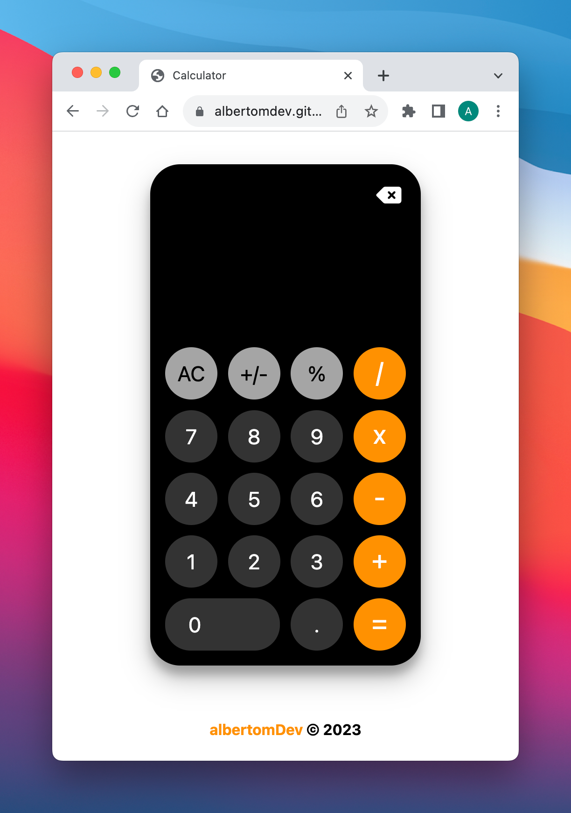

# Calculator

**Live Demo:** https://albertomdev.github.io/calculator/

This project is part of The Odin Project curriculum.

I am not a UI designer, so I like to take inspiration from other creators. Cloning projects from creators that are better than me, forces me think hard and google a lot. This time I tried to clone the iPhone's calculators with a few extra features.

## Technologies used

- HTML
- CSS
- JavaScript

## Features

- Addition, subtraction, multiplication, division
- Keyboard and touch support
- Delete and clear
- Negative numbers
- Known limitation
  - When the deleting numbers, if the number is negative and the negative sign is not deleted and new operator is operator is entered, it throws NaN

## Feedback

Feedback to improve or expand the calculator is welcome
